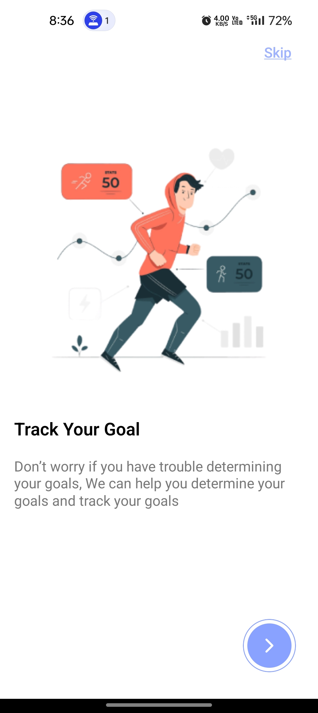
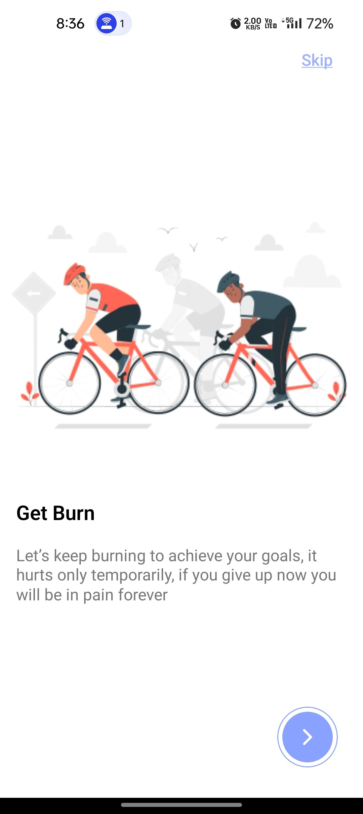
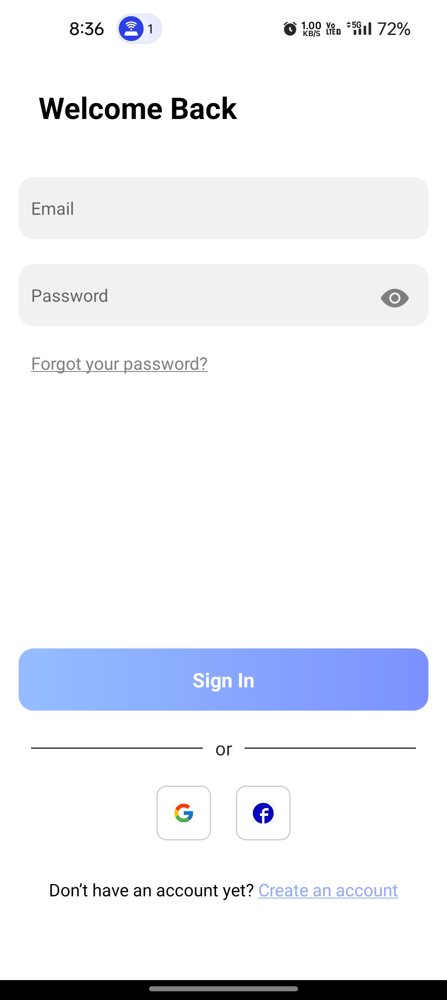
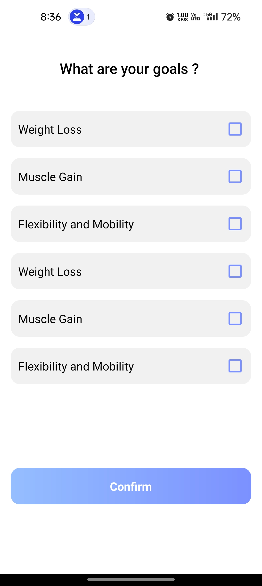
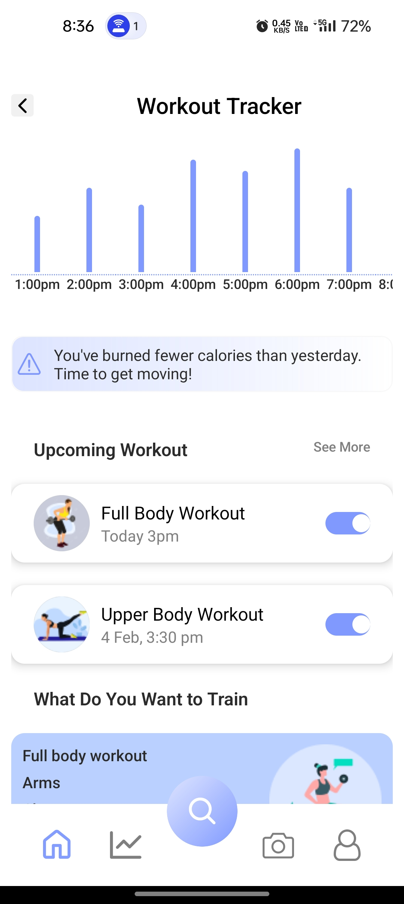

# Workout Tracker App

This Expo app helps you track your workouts and stay on top of your fitness goals.

## Screenshots

<div style="text-align:center">
    
</div>
---
<div style="text-align:center">
    
</div>
---
<div style="text-align:center">
    
</div>
---
<div style="text-align:center">
    
</div>
---
<div style="text-align:center">
    
</div>
---
<div style="text-align:center">
    
</div>

---

## Installation

1. Download the code to your local machine:
    ```
    git clone https://github.com/umakant3525/workoutTracker
    ```

    or download and unzip the file.

2. Navigate to the project directory in your terminal.

3. Install the necessary dependencies using npm:
    ```
    npm install
    ```

4. Start the Expo development server:
    ```
    npm start
    ```

5. Scan the QR code using the Expo Go app on your Android or iOS device to view the app.
