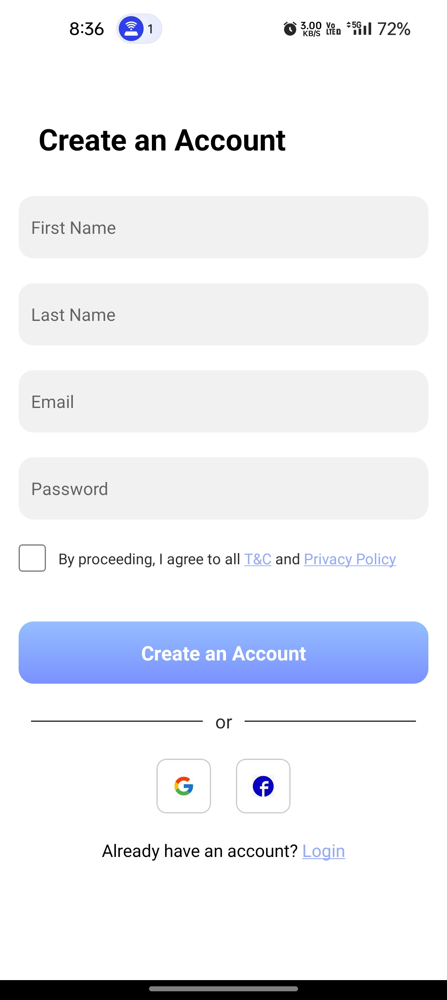

# Workout Tracker App

This Android application was developed using React Native and Expo. It serves as a comprehensive workout tracker, allowing users to monitor their exercise routines, set goals, and track progress seamlessly. Special thanks to the [Dacoid](https://www.dacoid.com/) team for providing the amazing Figma design, which contains amazing user experience in design user interface. I learned a lot of things from this application development phase.

### Figma
[Figma Design - View Here](https://www.figma.com/file/j3wxB67pZmYxK5LB71Hn2P/Assignment-Dacoid?type=design&node-id=1-36&mode=design&t=pUCV4QXoHBNaTapt-0)

## Screens

<div style="display: flex; flex-wrap: wrap; justify-content: center;">
    <div style="flex: 0 0 33.33%; margin: 10px;">
        
    </div>
    <div style="flex: 0 0 33.33%; margin: 10px;">
        
    </div>
    <div style="flex: 0 0 33.33%; margin: 10px;">
        
    </div>
    <div style="flex: 0 0 33.33%; margin: 10px;">
        
    </div>
    <div style="flex: 0 0 33.33%; margin: 10px;">
        
    </div>
    <div style="flex: 0 0 33.33%; margin: 10px;">
        
    </div>
    <div style="flex-basis: 100%; text-align: center; margin-top: 10px;">
        
    </div>
</div>

---

## Installation

1. **Clone the repository**:

    ```bash
    git clone https://github.com/umakant3525/workoutTracker
    ```

    or download and unzip the file.

2. **Navigate to the project directory** in your terminal.

3. **Install dependencies**:

    ```bash
    npm install
    ```

4. **Start the Expo development server**:

    ```bash
    npm start
    ```

5. **View the app**:

    Scan the QR code using the Expo Go app on your Android or iOS device to view the app.
